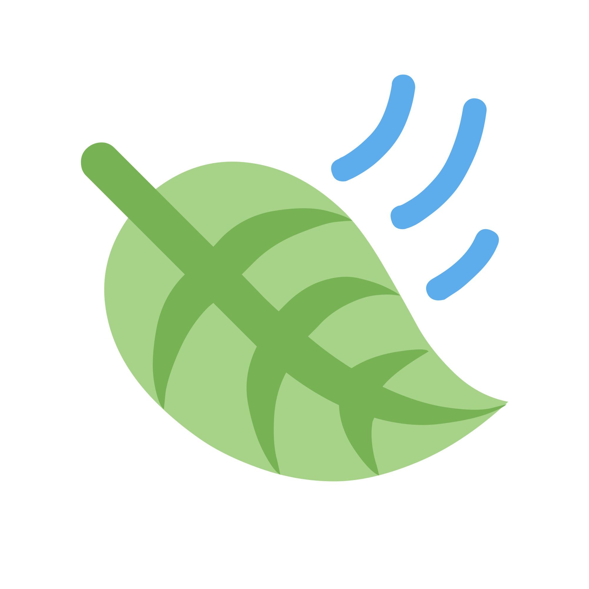
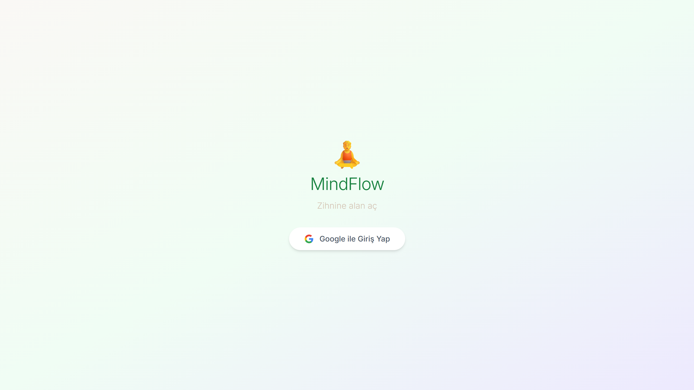
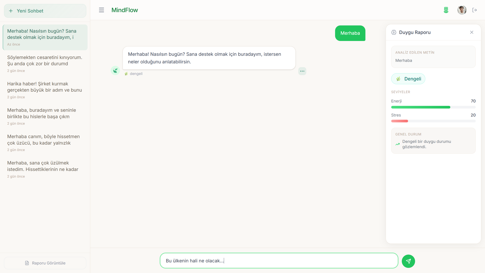
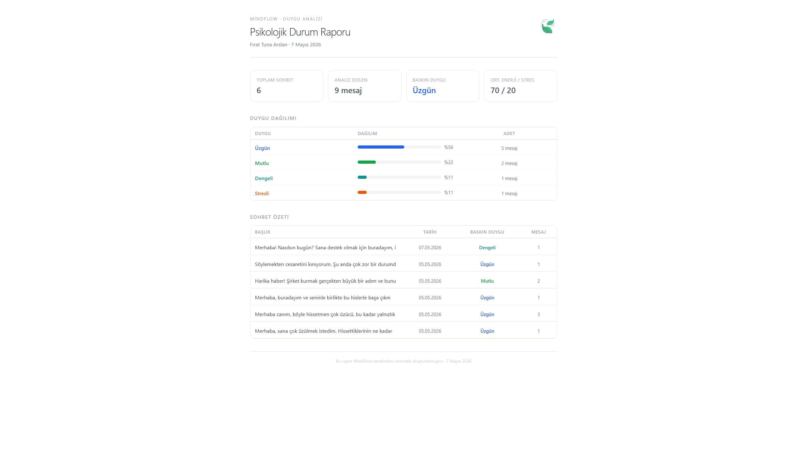
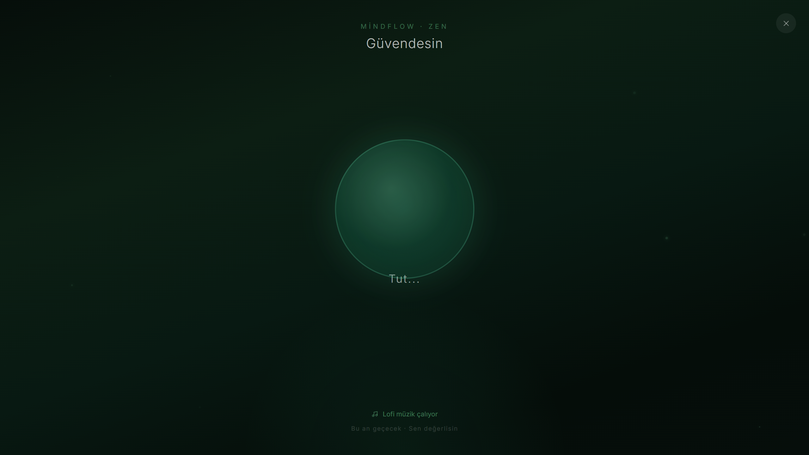

<div align="center">



# MindFlow

**Yapay zeka destekli duygu analizi ve farkındalık portalı**

[](https://react.dev)
[](https://www.typescriptlang.org)
[](https://fastapi.tiangolo.com)
[](https://ollama.com)
[](https://firebase.google.com)

</div>

---

## Proje Hakkında

MindFlow, kullanıcıların duygusal durumlarını yapay zeka ile analiz edebileceği, geçmiş sohbetlerini takip edebileceği ve stres/kriz anlarında nefes egzersizleriyle rahatlayabileceği bir mental sağlık destek uygulamasıdır.

> Bu proje bir okul ödevi kapsamında geliştirilmiştir.

---

## Özellikler

| Özellik | Açıklama |
|---|---|
| **AI Sohbet** | Ollama `gemma3:4b` modeli ile empatik Türkçe yanıtlar |
| **Duygu Analizi** | Her mesaj için enerji, stres ve duygu durumu tespiti |
| **Duygu Paneli** | Mesaj bazlı kayarak açılan duygu raporu |
| **Zen Modu** | Kritik durum tespitinde otomatik açılan nefes egzersizi |
| **Lofi Müzik** | Zen modunda YouTube'dan lofi müzik |
| **Sohbet Geçmişi** | Firebase Firestore'da kullanıcı bazlı chat arşivi |
| **PDF Rapor** | Tüm sohbetlerden otomatik oluşturulan duygu raporu |
| **Google Auth** | Firebase Authentication ile Google girişi |

---

## Ekran Görüntüleri

<div style="display: flex; flex-direction: column; flex-wrap: wrap; gap: 10px; justify-content: center;">
    
    
    
    
</div>

---

## Mimari

```
mindflow/
├── backend/          # FastAPI + Ollama
│   ├── routes/       # API endpoint'leri
│   └── services/     # Ollama ve Firebase servisleri
└── frontend/         # React + TypeScript
    ├── src/
    │   ├── components/
    │   ├── context/
    │   ├── services/
    │   └── types/
    └── public/
```

---

## Kurulum

### Gereksinimler

- Python 3.10+
- Node.js 18+
- [Ollama](https://ollama.com) kurulu ve çalışır durumda
- Firebase projesi (Auth + Firestore)

### 1. Ollama Modeli

```bash
ollama pull gemma3:4b
ollama serve
```

### 2. Backend

```bash
cd backend
pip install -r requirements.txt
cp .env.example .env   # .env dosyasını doldurun
uvicorn main:app --reload
```

### 3. Frontend

```bash
cd frontend
npm install
cp .env.example .env   # Firebase bilgilerini doldurun
npm run dev
```

Uygulama `http://localhost:5173` adresinde açılır.

---

## Teknoloji Yığını

**Frontend:** React 19 · TypeScript · Vite · Tailwind CSS · Framer Motion · Firebase SDK

**Backend:** FastAPI · Python · Ollama (gemma3:4b) · Firebase Admin SDK

**Altyapı:** Firebase Auth · Firestore · YouTube IFrame API

---

## Ekip

| Kişi | Sorumluluk |
|---|---|
| İclal Bülbül | Backend Mimarı |
| Alara Zere | AI Servisleri |
| Nisanur Balcıoğlu | Firebase Yönetimi |
| Betül Büyükgedikli | Backend-Frontend Bağlantısı |
| Fırat Tuna Arslan | Frontend & UI |
| Arda Balcı | Test & Raporlama |

---

<div align="center">
<sub>MindFlow · 2026</sub>
</div>
